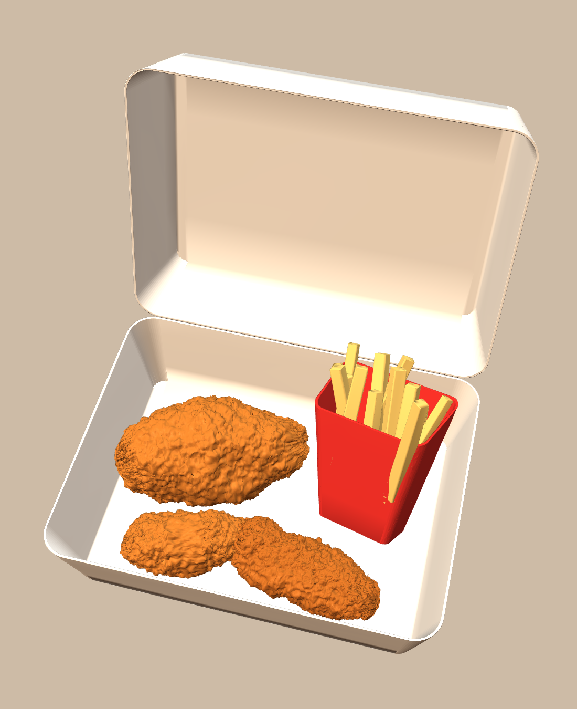
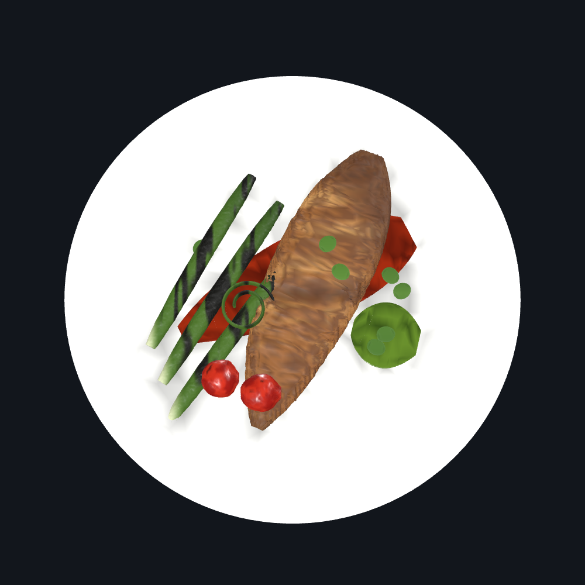
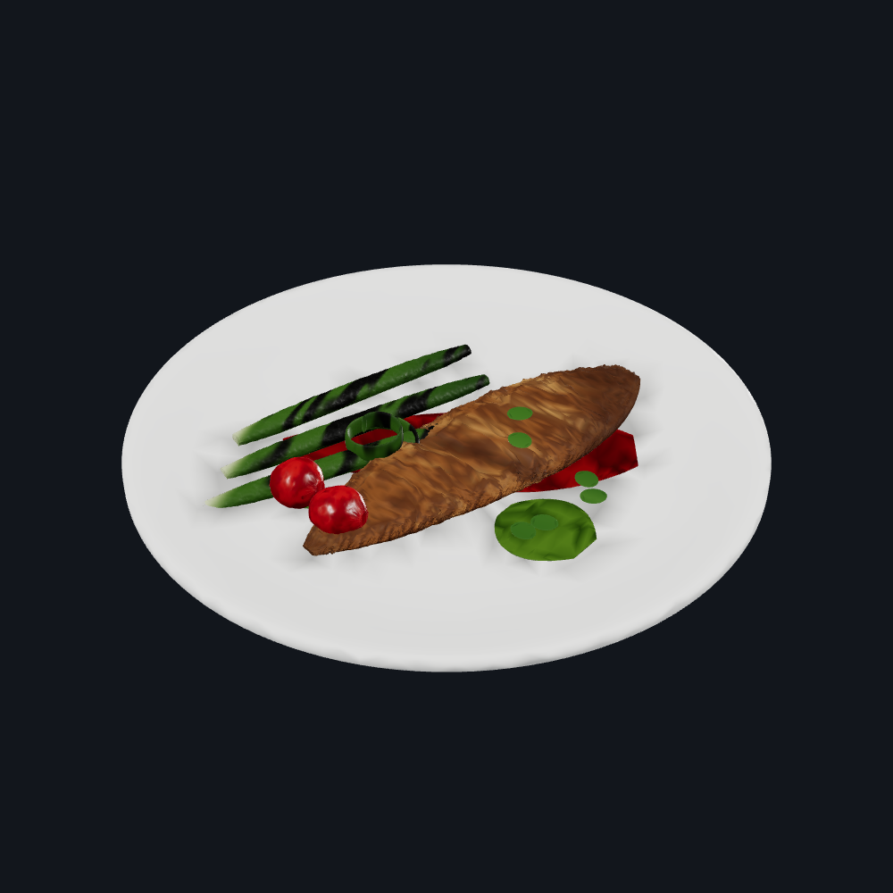

# Food models

Two dishes built from reference photos, both through the same two-stage
pipeline described below.

| Dish | Deliverable | Meshes | Triangles | Size |
| --- | --- | --- | --- | --- |
| Fast-food meal box | `meal_box.glb` | 20 | 434k | 10.4 MB |
| Plated fish | `plated_fish.glb` | 20 | 447k | 10.7 MB |




---

# 1 · Fast-food meal box

A generic fried-chicken meal box: open clamshell, three pieces of chicken, a
fries carton and chips.

## No branding

The packaging here is **deliberately generic**. No logos, no wordmarks, no
Colonel, no trade dress — those are trademarks and they are not reproduced in
the geometry or the materials. The red carton is a plain red carton.

If you hold the rights to particular branding, the carton and box are clean
single-material meshes and take a texture in Blender without any preparation.

## The two-stage pipeline, and why

A B-rep CAD kernel and a mesh are good at opposite halves of this job, so the
model uses both:

| Stage | Owns | Output |
| --- | --- | --- |
| **CAD** (build123d / OCCT) | Form — the tapered clamshell, the shelled carton, the slanted mouth trim, the chicken's underlying mass | `meal_assembly.step` |
| **Mesh** (`mesh_kit.py`) | Surface — breading, paper wobble | `meal_box.glb` |

**So the STEP contains smooth chicken cores and the GLB contains the crust.**
They are not interchangeable. That is a deliberate split, not an oversight.

### Why the crust is not CAD

The obvious solid-modelling trick for breading is to fuse a scatter of spheres
onto the core. That was built and abandoned:

- **74 large spheres** — fused fine, but read as a lumpy blob, closer to
  cauliflower than chicken.
- **438 small spheres** — a single multi-argument fuse returned a *null shape*.
  Batched into groups of 60 it survived, but left ~20 loose solids where bumps
  had been placed relative to the nominal section radius and never reached the
  shrunken core.
- Even when it worked it cost ~60 s per piece, against ~1.5 s for the loft.

OCCT has no displacement and no noise, and this is what faking it costs.
Displacement along vertex normals is the right tool for surface detail, so the
crust moved to the mesh stage: 4 s for all three pieces, and it actually looks
like fried chicken.

### How the crust is made

`mesh_kit.crust()` applies fractal value noise along vertex normals at three
scales, because one scale reads as either a dented balloon or as sandpaper:

| Scale | Amplitude | Frequency | Reads as |
| --- | --- | --- | --- |
| mass | 13.0 mm | 0.015 | irregular overall lump |
| mid | 6.0 mm | 0.050 | batter drips and folds |
| grain | 3.0 mm | 0.30 | crisp crumb |

Displacement can only move vertices that exist, so each piece is tessellated
finely and then midpoint-subdivided twice — roughly 4.4k triangles becomes
110k — before any noise is applied. A CAD tessellation on its own is far too
sparse and the noise just smears along the loft's iso-lines.

The noise is seeded, so every rebuild produces exactly the same model.

## Files

| File | What |
| --- | --- |
| `chicken_piece.py` | Lofted chicken cores — thigh, tender, wing |
| `packaging.py` | Clamshell base and lid, fries carton, chips |
| `meal_assembly.py` | Scene layout, `gen_step()` and `build_glb()` |
| `mesh_kit.py` | Tessellate, subdivide, noise, displace, GLB writer |
| `tools/preview.py` | Offscreen three.js render, for judging the model |

## Rebuilding

```bash
python meal_assembly.py                                   # GLB + preview
python plated_fish.py                                     # GLB + preview
python ../.claude/skills/cad/scripts/step meal_assembly.py  # STEP
```

## Verifying — check the file, not the preview

`tools/preview.py` renders the in-memory meshes. It is fast, and it is **not
the deliverable**. It has disagreed with the shipped GLB twice: once over sRGB
vs linear, once because glTF and three.js both multiply the material colour
into vertex colours and the preview did not. Both times the preview looked
right and the file did not.

So judge colour and lighting from `tools/verify_glb.py`, which loads the
written `.glb` through `THREE.GLTFLoader` — the same path any viewer takes —
under rigs that approximate a consumer GLB viewer:

```bash
python tools/verify_glb.py plated_fish.glb --out render/verify.png --preset studio
python tools/verify_glb.py plated_fish.glb --out render/verify.png --preset soft
```

`studio` is bright, frontal and untone-mapped, which is the setting that
exposes washed-out albedo. If it holds up there it holds up anywhere.

**Author albedo dark.** Under a bright studio rig anything above roughly 0.7
blows to white. Cooked-food albedo peaks nearer 0.4–0.55, and the palettes in
`shading.py` are set accordingly — they look too dark in isolation and correct
once lit.

Needs `build123d`, `cadpy`, `numpy`, and `playwright` for previews only.

## Notes and limits

1. **Per-vertex colour, no textures.** Meshes can vary in colour across their
   surface via glTF's `COLOR_0` attribute, which needs no textures and no UVs —
   see `shading.py`. That is what produces the char bands on the leeks, the
   browning on the fillet and the density variation in the sauces. The meal box
   predates this and still uses one flat colour per mesh.

   Two rules: `COLOR_0` is **linear**, like `baseColorFactor`, so the writer
   converts from sRGB; and when vertex colours are present the material factor
   must be **white**, because glTF multiplies the two. The same multiply exists
   in three.js, so `tools/preview.py` whites out its material colour too —
   otherwise the preview shows something darker and more saturated than the
   file, which is exactly the trap that made the fillet look orange.

   Still absent: roughness maps, normal maps, and any subsurface scattering.
   For a photoreal render, take the GLB into Blender.
2. **Colours are converted sRGB -> linear on export.** glTF defines
   `baseColorFactor` in *linear* space, but palettes get picked in sRGB. Writing
   sRGB values straight through makes every material render washed out, because
   the viewer applies its own linear->sRGB transfer on top - a 0.78 red arrives
   pink and golden chicken arrives cream. `mesh_kit.srgb_to_linear()` handles
   it, so author `color` in sRGB and let the writer convert. Note this is
   invisible in `tools/preview.py`, which renders the sRGB values directly;
   verify colour against the GLB itself through a real glTF loader.
3. **Y-up, metres.** Per the glTF convention the writer converts from
   millimetre Z-up CAD coordinates, so the 256 mm box arrives as 0.256 units.
4. **The layout is constrained by the tray taper.** The box narrows towards its
   floor, so contents sit against a footprint of ±113 × ±82 mm, not the ±126 ×
   ±95 mm of the rim. Three pieces poked through the walls before this was
   accounted for; there is now headroom for the crust pushing outward too.
5. **The carton leans less than in the reference photo.** Past about 40° its
   mouth intersects the open lid.
6. **Not watertight, not printable as-is.** Displacement is applied per body
   with no collision handling, and pieces are allowed to touch. This is a
   visual asset. The STEP is the clean geometry.

---

# 2 · Plated fish

A seared fillet on a white coupe plate, with a red pepper smear, a herb oil
dollop, charred leek batons, a rolled leek curl, roasted cherry tomatoes and
micro herbs. Built by `plated_fish.py` into `plated_fish.glb` and
`plated_fish.step`.



## Files

| File | What |
| --- | --- |
| `plate.py` | The plate — a single revolved profile |
| `fish.py` | Fillet core, and the `sear()` surface treatment |
| `garnish.py` | Leeks, curl, tomatoes, leaves, sauce bodies, `comb()` |
| `plated_fish.py` | Scene layout, `gen_step()` and `build_glb()` |

## Surface detail and baked lighting

The dish is built to a look brief: crisp browned crust with visible flaking,
blackened grill stripes, wrinkled tomato skins, thin glossy sauce smears that
follow the plate, and neutral lighting with contact shadows baked in.

**Ridged noise for crust.** Ordinary fbm gives rounded lumps. `mesh_kit.ridged`
returns `1 - |fbm|` sharpened, which puts a crease wherever the field crosses
zero — that is what reads as a flake edge. Two passes: coarse flakes then a
finer crisped layer. Both are deliberately coarse; **sub-millimetre
displacement is invisible at plate scale**, which is why the first attempt at
0.95 mm looked perfectly smooth.

**Colour tied to the same field.** The crust is geometrically there but reads
flat unless the crevices also go dark, so `shading.fish` re-evaluates the same
ridge field and browns the valleys.

**Anisotropy decides what a pattern *is*.** Fish flakes run across the fillet,
so the noise varies quickly along X and slowly across Y. Leek grill marks are
bands across the stalk — the same relationship. Sampled isotropically the char
reads as mould rather than grill marks.

**Baked lighting.** A GLB carries no shadows. `curvature_ao` darkens creases
from local concavity, and `contact_shadow` darkens the plate where food sits
close to it, both multiplied into the vertex colours. Keep the AO gentle: at
strength 0.75 every micro-crease on a ridged crust saturates and the fillet
turns into black camouflage.

**Sauces are draped, not placed.** `_drape()` offsets each sauce vertex by the
plate's local height so the film follows the well's curve instead of sitting
flat on a tangent plane, which otherwise floats at the outer edge.

## What this dish added to the toolkit

**Anisotropic noise.** The meal box only needed isotropic lumpiness — crumbs
are equally bumpy in every direction. Nothing on this plate is. A fish fillet
has grain running along its length where the muscle flakes separate, and a
sauce smear has comb lines from the drag of a spoon. Both are *directional*,
and isotropic noise renders them as generic bumpiness.

So `mesh_kit.roughen()` gained `axis_scale`, which stretches the noise field
per axis before sampling. Squash the sample along X and the lumps elongate into
streaks that follow the length. It also gained `mask`, a per-vertex multiplier,
used to fade displacement to nothing at the fillet's tips — the loft converges
to a tiny section there, and full-amplitude noise on a handful of tightly
packed vertices throws visible spikes off the ends.

**A deterministic crease.** The seam where a fillet's two muscle lobes meet is
not noise, so it is not left to the fractal: `fish.sear()` presses an explicit
Gaussian groove along `y = 0`, applied only to upward-facing vertices so the
flat underside is untouched.

**Seating parts on a curved surface.** The plate's well rises towards the rim,
so `plate_height()` samples the same control points the revolve uses and
`seat()` drops each garnish onto the actual surface. Dropping everything to one
height leaves the outer items floating or sunk.

## Things that went wrong, and what fixed them

| Symptom | Cause | Fix |
| --- | --- | --- |
| Plate came out 193 mm wide and 10 mm tall | The underside profile crossed the top surface near r≈96, splitting the wire into two loops. The revolve then quietly produced a stunted plate rather than failing | Redrew the underside with clearance everywhere; the profile now asserts it made exactly one closed wire |
| Fillet stood on its side | One rotation moves the loft's length onto X but leaves the section's axes swapped | Two rotations — `Rot(90,0,0) * Rot(0,90,0)` |
| Leek curl came out a knot | Ribbon 13 mm wide against a spiral radial pitch of 5.1 mm, so consecutive coils intersected | Widened the pitch, narrowed the ribbon, pinned an explicit vertical `x_dir` so it stands on edge; now asserts pitch > ribbon thickness |
| Micro herbs invisible | Placed inside the fillet's footprint, which is a ~58 mm wide band running most of the plate | Moved them clear of that band, with one deliberately lifted to rest on the fish |
| 47 MB, 2M triangles | Garnish-scale parts subdivided twice for no visible gain | Subdivision tuned per part; sauces keep two levels because the comb streaks need the resolution |

## Limits specific to this dish

- **No char marks on the leeks.** The reference has dark charred banding. With
  one flat colour per mesh the only way to express that is more meshes, and it
  would not survive as geometry anyway — it wants a texture. The leeks *are*
  split into green and pale meshes, which is the same trick applied where it
  does pay off.
- **The plate gets no displacement at all**, deliberately. Glazed porcelain is
  smooth, and noise on it reads as cheap ceramic.
- Everything in "Notes and limits" above applies here too, especially the flat
  colours and the sRGB→linear conversion.
